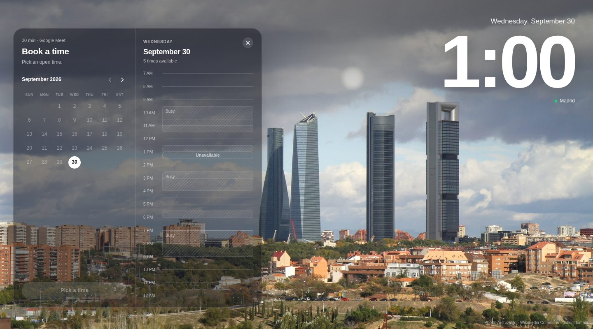
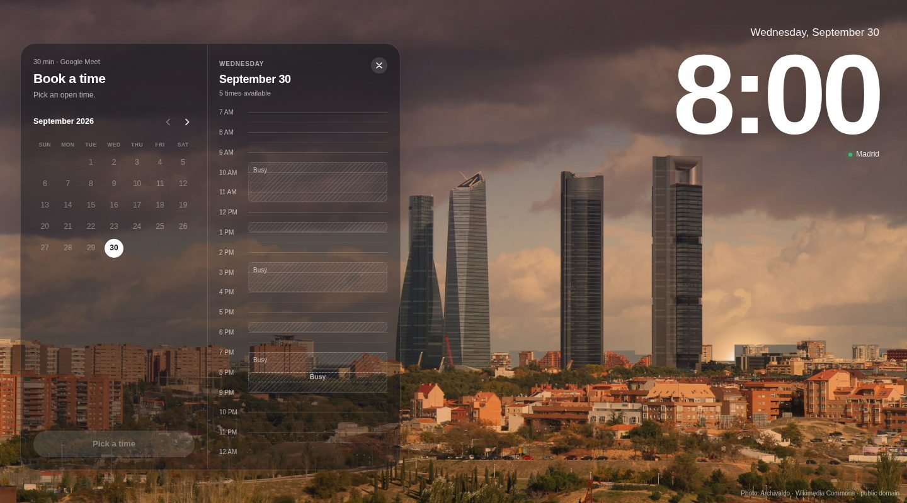
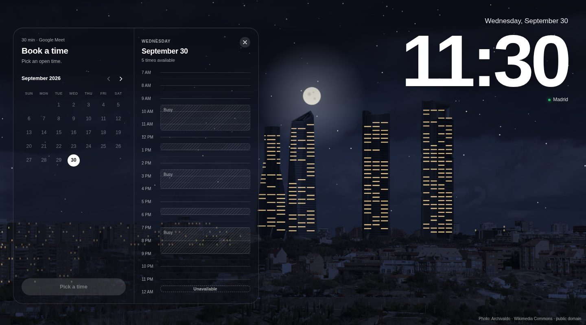

# Madrid Booking Calendar

A booking calendar where **the sky over Madrid follows the time you pick**. Slide down the day and watch it go from dawn, to blue noon, to an orange sunset behind the Cuatro Torres, to a starry night with the windows lit.

Inspired by [a design by @jonsouyang](https://x.com/jonsouyang/status/2105001165960466617). This is an independent, from-scratch open-source take: same idea, but the city is Madrid and the photo is real.

[Español](README.es.md)

| Day | Sunset | Night |
| --- | --- | --- |
|  |  |  |

## What makes it tick

- **A real photograph.** The background is a real photo of Madrid's Cuatro Torres (see [Credits](#credits)), not an illustration. It is lit by the sun's actual position: hover 8 PM and the light warms up, hover 11:30 PM and it's night.
- **A real sky clock.** For the date and time you hover, we compute the sun's elevation and azimuth over Madrid (`src/lib/sun.ts`). Sunset on 30 September is at a different hour than on 21 December.
- **The sun moves across the photo** and sets *behind the real buildings*: the skyline is traced as a mask, so the sun, moon and stars are hidden by the towers and rooftops in the picture.
- **Night on the same photo.** Exposure and saturation drop with the sun, a colour cast is multiplied over the picture (orange at dusk, blue at night), stars and a moon appear, and the towers' floors light up.
- **Smooth.** Hovering jumps around the timeline, but the light eases toward the target instead of snapping. It respects `prefers-reduced-motion`.
- **Time-zone safe.** Everything is Madrid wall-clock time, converted with `Intl` (DST included), so it doesn't matter where the visitor's browser is.
- **Accessible-ish by default.** Real buttons, ARIA roles, keyboard focus, `Esc` to go back.
- **Bilingual.** Spanish and English, picked from the browser language.
- **Tiny code.** React + Vite + TypeScript, no UI or date libraries (~78 kB gzipped, plus one 350 kB photo).

## Run it

```bash
npm install
npm run dev        # http://localhost:5173
npm test           # unit tests for the time zone, sun, sky and availability logic
npm run build      # static site in dist/
```

Requires Node 20+.

## Make it yours

Everything you'd want to change is in [`src/config.ts`](src/config.ts): your name, meeting length and provider, working days and hours, minimum notice, how far ahead people can book, the language, and an optional "Home" link.

### Real availability

Out of the box the "busy" blocks are **fake** (deterministic per day, so the demo looks alive). To use your real calendar, implement one small interface in [`src/lib/availability.ts`](src/lib/availability.ts):

```ts
interface AvailabilityProvider {
  busy(date: YMD): Interval[]; // [{ start: 600, end: 660 }] = 10:00–11:00
}
```

and pass it to `createAvailability(config, yourProvider)` in `App.tsx`. Because `busy` is synchronous, fetch your free/busy data up front (Google Calendar, Cal.com, an `.ics` feed…) and hand it over already loaded.

### Receiving bookings

There is no backend. On confirm, the app shows a success screen and offers an `.ics` download. To actually receive bookings, set `VITE_BOOKING_ENDPOINT` (see [`.env.example`](.env.example)) to any URL that accepts a JSON `POST` (a serverless function, Formspree, an n8n or Zapier webhook…). The payload is the `Booking` type in [`src/lib/booking.ts`](src/lib/booking.ts).

## How the light works

Everything is drawn in the photo's own pixel space, in layers that stay glued to it at any screen size (`src/components/PhotoSky.tsx`):

1. the **photo**, with a CSS `brightness()`/`saturate()` filter driven by the sun's elevation;
2. a **colour cast** multiplied over it, from top to horizon (`src/lib/sky.ts` holds the keyframes);
3. **lit windows** on the four towers and a sprinkle on the apartment blocks;
4. **sun, moon and stars**, clipped by a hand-traced **skyline mask** (`src/lib/photo.ts`).

Only a handful of numbers change per animation frame; nothing is re-decoded or re-laid-out.

### Use your own photo (or another city)

Swap `src/assets/madrid-cuatro-torres.jpg` and re-measure the geometry in `src/lib/photo.ts`: the photo size, the horizon, the skyline mask (`EDGE`) and the tower outlines. Sky-heavy, wide photos with a clear skyline work best. Draw the sun's arc with `project()` and pick coordinates for `MADRID` in `src/lib/sky.ts`.

## How it's organised

```
src/
  config.ts                  ← the knobs you edit
  App.tsx                    ← state machine: pick → details → done
  assets/                    ← the photograph
  components/
    PhotoSky.tsx             ← photo + lighting layers
    MonthCalendar.tsx  DayTimeline.tsx  DetailsForm.tsx  Clock.tsx
  lib/
    sun.ts                   ← solar position
    sky.ts                   ← sun elevation → exposure, tint, lights
    photo.ts                 ← skyline mask, tower outlines, sun projection
    time.ts                  ← Madrid time zone helpers
    availability.ts  calendar.ts  i18n.ts  ics.ts  booking.ts
  styles/
```

## Deploy

It's a static site. `npm run build` and upload `dist/` anywhere. The included workflow deploys to **GitHub Pages** on every push to `main` (enable it once under Settings → Pages → Source: GitHub Actions).

## Contributing

Ideas that would be great: other cities (a photo plus its `photo.ts` geometry and coordinates), an automatic skyline mask, a Google Calendar provider, weather-aware clouds, dark/light card themes. Open an issue or a PR; please run `npm run typecheck && npm test` first.

## License

[MIT](LICENSE) for the code. Design inspiration credit to [@jonsouyang](https://x.com/jonsouyang).

## Credits

Photo: [*Torres de Madrid*](https://commons.wikimedia.org/wiki/File:Torres_de_Madrid.JPG) by Archivaldo, Wikimedia Commons, public domain. It is cropped and resized; nothing else is altered on disk. All lighting is applied live in the browser.
