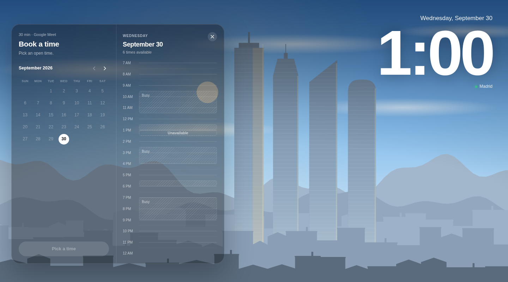
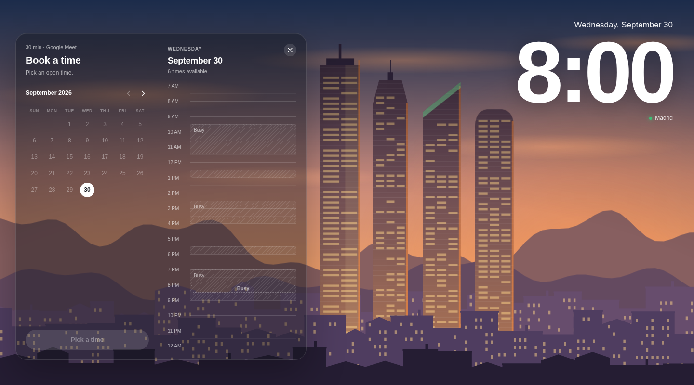
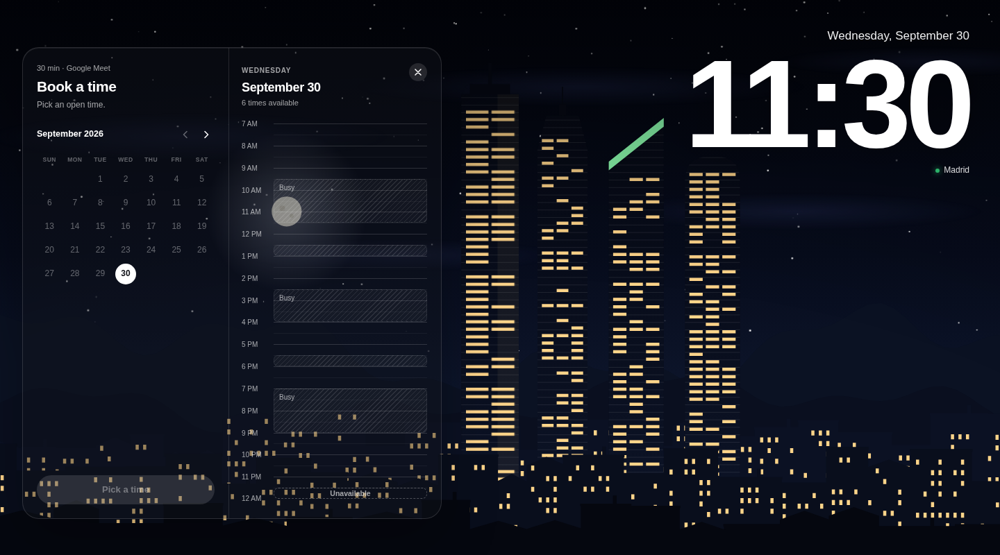

# Madrid Booking Calendar

A booking calendar where **the sky over Madrid follows the time you pick**. Slide down the day and watch it go from dawn, to blue noon, to an orange sunset behind the Cuatro Torres, to a starry night with the windows lit.

Inspired by [a design by @jonsouyang](https://x.com/jonsouyang/status/2105001165960466617). This is an independent, from-scratch open-source take: same idea, but the city is Madrid, and the whole scene is drawn in code.

[Español](README.es.md)

| Day | Sunset | Night |
| --- | --- | --- |
|  |  |  |

## What makes it tick

- **No photos, no licences.** The skyline (the four towers of the Cuatro Torres Business Area, the Sierra de Guadarrama behind them, and a few hundred rooftops) is a procedural SVG generated from a seeded random function. Nothing is downloaded; the picture is identical on every load.
- **A real sky, not a slideshow.** For the date and time you hover, we compute the sun's actual elevation and azimuth over Madrid (`src/lib/sun.ts`) and interpolate a palette from it (`src/lib/sky.ts`). Sunset on 30 September is at a different hour than on 21 December, and the moon rises opposite the sun.
- **Smooth.** Hovering jumps around the timeline, but the sky eases toward the target instead of snapping. It respects `prefers-reduced-motion`.
- **Time-zone safe.** Everything is Madrid wall-clock time, converted with `Intl` (DST included), so it doesn't matter where the visitor's browser is.
- **Accessible-ish by default.** Real buttons, ARIA roles, keyboard focus, `Esc` to go back, reduced-motion support.
- **Bilingual.** Spanish and English, picked from the browser language.
- **Tiny.** React + Vite + TypeScript, no UI or date libraries. ~79 kB gzipped.

## Run it

```bash
npm install
npm run dev        # http://localhost:5173
npm test           # unit tests for the time zone, sun, sky and availability logic
npm run build      # static site in dist/
```

Requires Node 20+.

## Make it yours

Everything you'd want to change is in [`src/config.ts`](src/config.ts): your name, meeting length and provider, working days and hours, minimum notice, how far ahead people can book, the language, and an optional "Home" link.

### Real availability

Out of the box the "busy" blocks are **fake** (deterministic per day, so the demo looks alive). To use your real calendar, implement one small interface in [`src/lib/availability.ts`](src/lib/availability.ts):

```ts
interface AvailabilityProvider {
  busy(date: YMD): Interval[]; // [{ start: 600, end: 660 }] = 10:00–11:00
}
```

and pass it to `createAvailability(config, yourProvider)` in `App.tsx`. Because `busy` is synchronous, fetch your free/busy data up front (Google Calendar, Cal.com, an `.ics` feed…) and hand it over already loaded.

### Receiving bookings

There is no backend. On confirm, the app shows a success screen and offers an `.ics` download. To actually receive bookings, set `VITE_BOOKING_ENDPOINT` (see [`.env.example`](.env.example)) to any URL that accepts a JSON `POST` (a serverless function, Formspree, an n8n or Zapier webhook…). The payload is the `Booking` type in [`src/lib/booking.ts`](src/lib/booking.ts).

## How it's organised

```
src/
  config.ts                  ← the knobs you edit
  App.tsx                    ← state machine: pick → details → done
  components/
    MadridSky.tsx            ← the scene; colours arrive as CSS variables
    MonthCalendar.tsx  DayTimeline.tsx  DetailsForm.tsx  Clock.tsx
  lib/
    sun.ts                   ← solar position
    sky.ts                   ← sun elevation → palette
    skyline.ts               ← procedural buildings and landmarks
    time.ts                  ← Madrid time zone helpers
    availability.ts  calendar.ts  i18n.ts  ics.ts  booking.ts
  styles/
```

The scene re-renders every animation frame only through a handful of CSS variables and the sun/moon positions; the ~2,000 building and window shapes are memoised and never re-rendered.

## Deploy

It's a static site. `npm run build` and upload `dist/` anywhere. The included workflow deploys to **GitHub Pages** on every push to `main` (enable it once under Settings → Pages → Source: GitHub Actions).

## Contributing

Ideas that would be great: other cities (a `skyline.ts` per city + coordinates), more landmarks, a Google Calendar provider, weather-aware clouds, dark/light card themes. Open an issue or a PR; please run `npm run typecheck && npm test` first.

## License

[MIT](LICENSE). Design inspiration credit to [@jonsouyang](https://x.com/jonsouyang).
